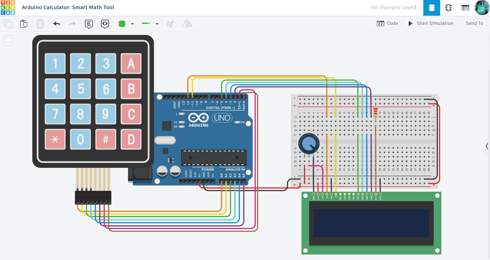

# 🧮 Arduino Calculator: Smart Math Tool

A fully functional digital calculator designed to perform basic arithmetic operations using a matrix input and visual feedback.

## 📌 Project Overview
The "Smart Calculator" transforms an Arduino into a handheld computing device. It allows users to input numbers, choose mathematical operations, and view results in real-time. The system is designed to be intuitive, guiding the user through each step of the calculation via an LCD screen.

## ⚙️ How it Works (Game Logic)
1. **Number Entry:** The system prompts the user to enter the first number, then the second, using the 4x4 keypad.
2. **Operation Selection:** After numbers are entered, the user selects a mathematical operation (A for +, B for -, C for *, D for /).
3. **Calculation:** The code processes the inputs and displays the complete equation with the result.
4. **System Reset:** - Pressing the `*` key clears all memory and variables.
   - The screen returns to the initial "Enter 1st No." prompt.
   - The system is ready for a new calculation cycle.

## 🛠 Technical Features
- **Matrix Scanning:** Uses the `Keypad.h` library to efficiently monitor 16 individual buttons using only 8 Arduino pins.
- **Interactive Interface:** Implements `lcd.blink()` and `lcd.setCursor()` to create a responsive and user-friendly experience.
- **State Machine Logic:** A dedicated counter (`ctr`) manages the sequence of operations to ensure correct data flow between inputs.

## 🔌 Components Used
- **Microcontroller:** Arduino Uno R3
- **Inputs:** 4x4 Matrix Keypad
- **Visual Output:** 16x2 LCD Display
- **Control:** Potentiometer (for LCD contrast adjustment)
- **Others:** 220Ω Resistor, Breadboard, and Jumper wires.

## 📐 Circuit Diagram

*Designed and simulated in Tinkercad.*

## 🚀 Installation & Use
1. **Get the Code:** Open the [main.ino](./main.ino) file and copy the source code.
2. **Setup:** Paste the code into your Arduino IDE or a new Tinkercad "Code" block.
3. **Hardware:** Connect the Matrix Keypad and LCD to the pins specified in the `main.ino` header.
4. **Play:** Start the simulation, enter your numbers, choose an operation, and get your result!

## 📺 Video Demonstration

## 🔗 Interactive Simulation

