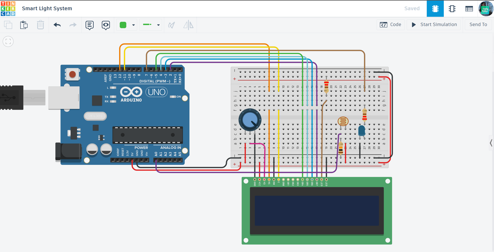

# 💡 Smart Light System with LCD

An automated lighting solution that adjusts and monitors ambient light levels using an LDR sensor and displays real-time data on an LCD screen.

## 📌 Project Overview
This project simulates a smart home lighting controller. It detects the brightness of the environment; if it gets too dark, the system automatically turns on the light (LED) and updates the status and brightness percentage on the 16x2 LCD display.

## ⚙️ How it Works (Logic)
1. **Light Sensing:** The Photoresistor (LDR) reads analog light levels from the environment.
2. **Data Processing:** The Arduino converts the analog signal into a percentage (0% to 100%).
3. **Automation:** - If light falls below a set threshold, the LED turns **ON**.
   - If light is sufficient, the LED stays **OFF**.
4. **Monitoring:** The LCD display shows the current "Light Level" and the system "Status" (Night/Day).

## 🛠 Technical Features
- **Analog-to-Digital Conversion:** Precise mapping of sensor data to user-friendly percentages.
- **Hysteresis Logic:** Prevents flickering of the light when at the threshold level.
- **Real-time Interface:** Constant updates to the LCD for visual monitoring.

## 🔌 Components Used
- Arduino Uno R3
- 16x2 LCD Display (LiquidCrystal)
- Photoresistor (LDR)
- Blue LED
- Potentiometer (for LCD contrast)
- 220Ω & 10kΩ Resistors
- Jumper wires & Breadboard

## 📐 Circuit Diagram

*Designed and simulated in Tinkercad.*

## 🚀 Installation & Use
1. Copy the code from [main.ino](./main.ino).
2. Set up the circuit as per the Tinkercad design.
3. Observe how the LED reacts to changing light levels in the simulation.
