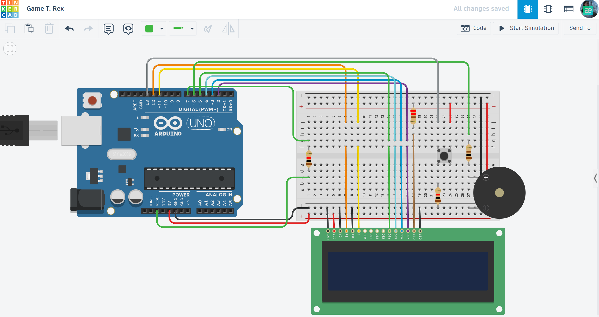

# 🦖 Arduino T-Rex Dino Game

A professional recreation of the iconic Google Chrome offline dinosaur game, built with Arduino, a character display, and single-button control.

## 📌 Project Overview
"T-Rex Dino" is an arcade-style game where players control a running dinosaur that must jump over approaching cactus obstacles. The goal is to survive as long as possible and achieve a high score, which increases dynamically. The game features custom display characters and acoustic feedback.

## ⚙️ How it Works (Game Logic)
1. **Game Start:** The screen displays a "Press Start" message, and the buzzer plays a short melody.
2. **Player Input:** A single push button triggers the dinosaur to jump.
3. **Obstacles & Collision:** Cactus sprites (custom LCD characters) approach from the right. A high-speed loop monitors the dinosaur's Y-coordinate to check for collisions.
4. **Game Over:** - The dinosaur sprite is replaced by a "Dead" sprite.
   - The buzzer sounds a "Game Over" tone sequence.
   - The final score is displayed before resetting for a new round.

## 🛠 Technical Features
- **Custom Sprites:** Utilizes `lcd.createChar()` to define the dinosaur (running/jumping/dead) and the cactus obstacle.
- **Dynamic Scoring:** Implements a timer-based system that increases the player's score for every second of survival.
- **Acoustic Feedback:** Uses the Piezo buzzer and `tone()` function for synchronized jump and crash sounds.

## 🔌 Components Used
- **Microcontroller:** Arduino Uno R3
- **Input:** Push Button
- **Acoustic Output:** Piezo Buzzer
- **Visual Output:** 16x2 LCD Display (LiquidCrystal)
- **Others:** 10kΩ Resistor, Potentiometer, Breadboard, and Jumper wires.

## 📐 Circuit Diagram

*Designed and simulated in Tinkercad.*

## 🚀 Installation & Use
1. **Get the Code:** Open the [main.ino](./main.ino) file and copy the source code.
2. **Setup:** Paste the code into your Arduino IDE or a new Tinkercad "Code" block.
3. **Hardware:** Connect the LCD, button, and buzzer to the specified digital pins in the `main.ino` header.
4. **Play:** Start the simulation, wait for the buzzer signal, and jump to survive!

## 📺 Video Demonstration

