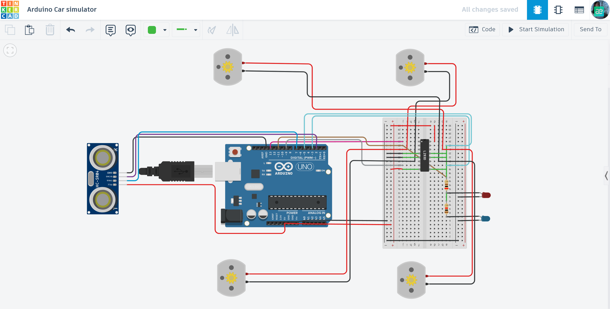

# 🏎️ Arduino Smart Car: Obstacle Avoidance System

An autonomous 4-wheel robot capable of navigating through environments by detecting and avoiding obstacles using ultrasonic sensing.

## 📌 Project Overview
This project focuses on robotics and embedded logic. The car uses an ultrasonic sensor to "scan" the path ahead. If an obstacle is detected within a certain range, the system automatically changes its direction to avoid a collision.

## ⚙️ How it Works (System Logic)
1. **Distance Measurement:** The HC-SR04 sensor sends ultrasonic waves and measures the time it takes for them to bounce back.
2. **Decision Making:** The Arduino calculates the distance in real-time. If the distance is less than a predefined threshold (e.g., 20cm), the car stops.
3. **Movement Control:** The L293D H-Bridge driver manages four DC motors, allowing the car to move forward, backward, and perform turns by reversing motor polarity.
4. **Visual Feedback:** Integrated LEDs indicate the car's current status (e.g., moving forward or detecting an obstacle).

## 🛠 Technical Features
- **Obstacle Detection:** Real-time distance processing using the `pulseIn()` function.
- **Motor Driving:** Dual-channel H-Bridge control for independent left/right side movement.
- **Autonomous Navigation:** Fully automated logic without manual remote control.

## 🔌 Components Used
- **Microcontroller:** Arduino Uno R3
- **Sensors:** HC-SR04 Ultrasonic Distance Sensor
- **Motor Driver:** L293D IC (H-Bridge)
- **Actuators:** 4x DC Motors
- **Visual Outputs:** 2x LEDs (Red & Blue status indicators)
- **Power:** 9V Battery / USB Power simulation
- **Others:** 220Ω Resistors, Breadboard, and Jumper wires.

## 📐 Circuit Diagram

*Designed and simulated in Tinkercad.*

## 🚀 Installation & Use
1. **Get the Code:** Open the [main.ino](./main.ino) file and copy the source code.
2. **Setup:** Paste the code into your Arduino IDE or Tinkercad "Code" block.
3. **Hardware:** Connect the L293D driver to pins 3, 4, 5, and 6 for motor control.
4. **Test:** Run the simulation and move the obstacle in front of the sensor to see the car react!

## 📺 Video Demonstration

