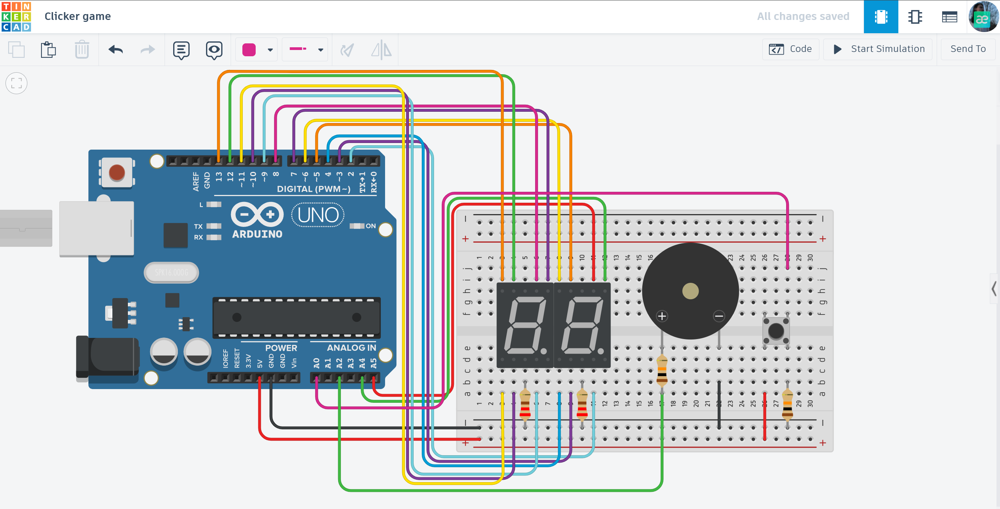

# 🖱️ Arduino Clicker Game: 99 Levels of Sound

A fast-paced digital clicker game where players race to reach the maximum score of 99, featuring dynamic audio feedback for every milestone.

## 📌 Project Overview
The "Arduino Clicker" transforms a simple button and two 7-segment displays into an engaging handheld game. It focuses on tactile speed and visual progression, using a rising sound frequency to reward the player as they advance through the "tens" levels.

## ⚙️ How it Works (Game Logic)
1. **The Clicker:** The player taps the button to increase the count. Each successful tap is confirmed by a short 1000Hz beep.
2. **Leveling Up:** Every time the player reaches a new decade (10, 20, 30...), the system plays a longer, unique tone.
3. **Dynamic Sound:** The frequency of the "Level Up" sound increases as the score gets higher ($400Hz + (tens \times 100Hz)$), creating a sense of urgency and achievement.
4. **System Reset:**
   - After reaching the maximum score of 99, the next click resets the counter to 00.
   - The game starts over, ready for a new high-speed run.

## 🛠 Technical Features
- **Segment Mapping:** Uses a custom `byte` array and `bitRead()` to efficiently drive 14 individual LED segments.
- **Dynamic Audio Synthesis:** Implements a frequency-shifting algorithm that maps the game state to specific sound pitches.
- **Analog-to-Digital Logic:** Utilizes `analogRead()` with a threshold (500) to detect button presses, showcasing flexible pin usage.
- **Input Debouncing:** A calculated 150ms delay prevents mechanical button bounce from causing accidental double-clicks.

## 🔌 Components Used
- **Microcontroller:** Arduino Uno R3
- **Inputs:** High-tactile Push Button
- **Visual Output:** 2x 7-Segment Displays (Common Cathode)
- **Audio Output:** Piezo Buzzer
- **Others:** 220Ω Resistors, Breadboard, and Jumper wires.

## 📐 Circuit Diagram

*Designed and simulated in Tinkercad.*

## 🚀 Installation & Use
1. **Get the Code:** Open the [main.ino](./main.ino) file and copy the source code.
2. **Setup:** Paste the code into your Arduino IDE or a new Tinkercad "Code" block.
3. **Hardware:** Connect the components to the pins specified in the `onesPins`, `tensPins`, and `buzzerPin` headers.
4. **Play:** Start the simulation, tap the button as fast as you can, and reach level 99!

## 📺 Video Demonstration

## 🔗 Interactive Simulation

