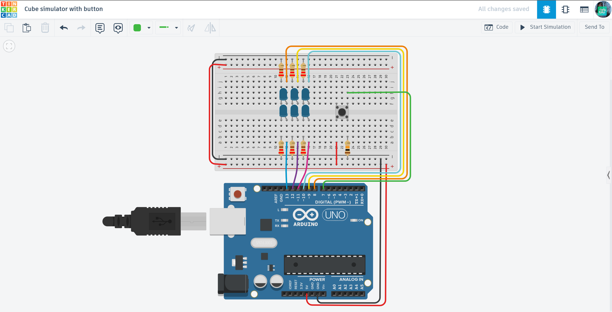

# 🎲 Arduino Dice Simulator

An interactive Arduino-based project that simulates a physical dice roll. By pressing a button, the system generates a random number from 1 to 6 and displays it through a specific LED configuration.

## 📌 Project Overview
The "Cube Simulator with Button" is a digital version of a classic game dice. Instead of throwing a cube, you press a button, and the Arduino generates a random number from 1 to 6, displaying it through a specific pattern of LEDs. This project demonstrates how to handle user input and implement randomization logic in C++.

## ⚙️ How it Works (Logic)
1. **Interaction:** The system stays idle until the user presses the tactile button.
2. **Rolling Animation:** When triggered, the LEDs flicker in a fast sequence to simulate the "rolling" of a dice.
3. **Random Generation:** The Arduino uses the `random()` function to pick a number between 1 and 6.
4. **Display:** A specific set of LEDs lights up to represent the result (e.g., 3 LEDs for number 3).

## 🛠 Technical Features
- **Digital Input Handling:** Detects button presses using `digitalRead` with a pull-down resistor logic.
- **Randomization:** Employs `randomSeed()` to ensure that every "roll" is truly unpredictable.
- **Efficient Mapping:** Uses conditional logic to map the generated number to the corresponding LED pins.
- **Debouncing:** Simple code-based delay to ensure one press equals exactly one roll.

## 🔌 Components Used
- **Microcontroller:** Arduino Uno R3
- **Light Sources:** 6x LEDs
- **Input:** 1x Pushbutton
- **Protection:** 6x 220Ω Resistors (for LEDs) and 1x 10kΩ Resistor (for the button)
- **Connection:** Breadboard & Jumper wires

## 📐 Circuit Diagram

*Designed and simulated in Tinkercad.*

## 🚀 Installation & Use
1. **Get the Code:** Open the [main.ino](./main.ino) file and copy the source code.
2. **Setup:** Connect the 6 LEDs and the button to the pins as shown in the schematic (digital pins 13-7).
3. **Upload:** Flash the code to your Arduino Uno.
4. **Play:** Press the button and see what number you get!

## 📺 Video Demonstration

## 🔗 Interactive Simulation

