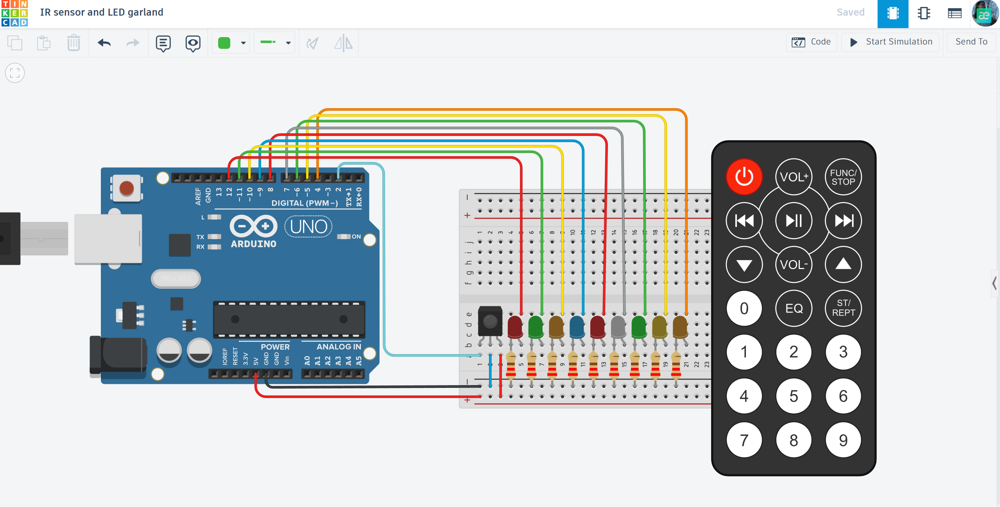

# 📡 IR Controlled LED Garland

An advanced lighting project featuring an infrared (IR) remote control to manage an 8-LED sequence with multiple animation modes.

## 📌 Project Overview
The "IR Sensor and LED Garland" moves beyond simple switches by implementing wireless control. Using an IR receiver and a remote, this project allows users to toggle, dim, or change patterns of an 8-LED array, simulating real-world festive lighting or smart home decor.

## ⚙️ How it Works (Logic)
1. **Wireless Input:** The IR sensor receives encoded signals from the remote control.
2. **Signal Decoding:** The Arduino decodes these signals using the `IRremote` library to identify which button was pressed.
3. **Pattern Control:** Based on the command (e.g., Vol+, Play, Numbers), the Arduino triggers different functions to control the 8-LED sequence.
4. **Visual Feedback:** 8 LEDs respond instantly, showing different speeds or patterns like "chasing lights" or "fading."

## 🛠 Technical Features
- **Signal Processing:** Decoding HEX codes from an IR Remote.
- **Array Management:** Controlling 8 digital pins efficiently through code loops.
- **Interrupt Simulation:** Using the remote to switch between complex lighting animations in real-time.

## 🔌 Components Used
- **Microcontroller:** Arduino Uno R3
- **Input:** IR Receiver (Infrared Sensor) & IR Remote
- **Light Sources:** 8x Multicolored LEDs
- **Protection:** 8x 220Ω Resistors
- **Connection:** Breadboard & Jumper wires

## 📐 Circuit Diagram

*Designed and simulated in Tinkercad.*

## 🚀 Installation & Use
1. **Get the Code:** Open the [main.ino](./main.ino) file.
2. **Setup:** Connect the IR sensor to pin 11 and LEDs to pins 10-3.
3. **Upload:** Flash the code and use the remote to change the atmosphere!

## 📺 Video Demonstration
)

## 🔗 Interactive Simulation

