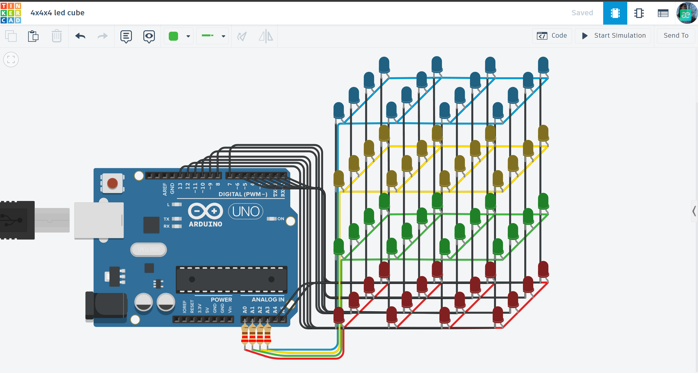

# 🧊 3D LED Cube 4x4x4 (L12-Matrix)

An advanced visual project demonstrating 3D light animations using multiplexing techniques and manual matrix wiring.

## 📌 Project Overview
This project is a 4x4x4 LED cube, totaling 64 LEDs controlled by only 20 pins of an Arduino Uno. It showcases how to control a large number of outputs using a layered multiplexing strategy, where LEDs are organized into 16 columns (anodes) and 4 layers (cathodes).

## ⚙️ How it Works (System Logic)
The cube operates on a coordinate system (X, Y, Z):
* **Multiplexing:** Instead of controlling each LED individually, the system switches between layers very rapidly. To the human eye, this creates the illusion of a solid 3D image (Persistence of Vision).
* **Anode Columns (16 pins):** Control which "vertical line" is active in a specific layer.
* **Cathode Layers (4 pins):** Control which horizontal level is currently powered.
* **Animations:** The code includes various patterns: rain effects, expanding squares, and random blinking.

## 🛠 Technical Highlights
- **Layered Multiplexing:** Efficiently controls 64 LEDs using a minimal number of I/O pins.
- **POV (Persistence of Vision):** Optimized refresh rates to eliminate flickering.
- **Complex Wiring:** Demonstration of high-density breadboard/PCB layout and cable management.

## 🔌 Components Used
- **Microcontroller:** Arduino Uno R3
- **Light Sources:** 64x LEDs (organized in 4 layers of 16)
- **Current Control:** 4x Resistors (protecting the layer transistors/pins)
- **Structure:** Custom 3D wire frame or Tinkercad simulation layout.

## 📐 Circuit Diagram

*Designed and simulated in Tinkercad.*

## 🚀 Installation & Use
1. Copy the code from [main.ino](./main.ino) to your Arduino environment.
2. Ensure the pin mapping matches your physical or simulated wiring.
3. Upload and enjoy the 3D light show!

## 📺 Video Demonstration

## 🔗 Interactive Simulation

