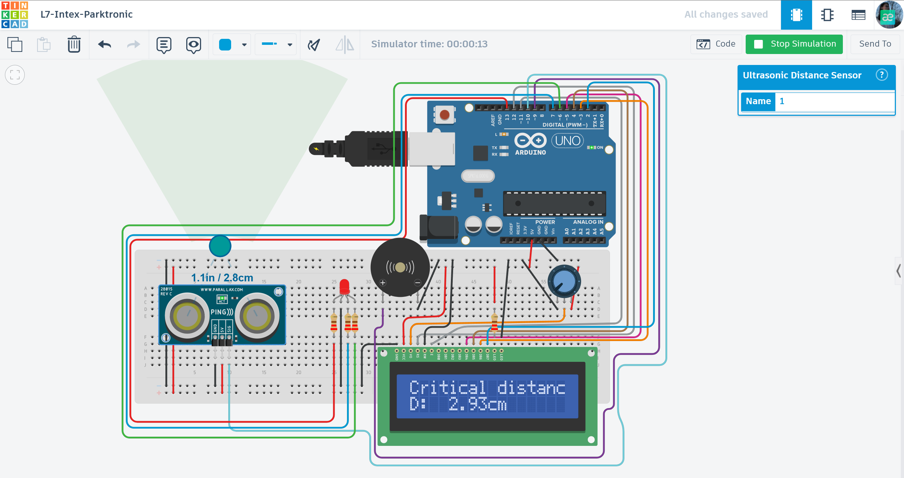

# 🚗 Arduino Parktronic System (L7-Intex)

Technical implementation of a parking assistance system using ultrasonic sensors and real-time visual/audio feedback.

## 📌 Project Overview
This system measures the distance to obstacles and alerts the driver through an LCD display, an RGB LED, and a buzzer. It is designed to enhance vehicle safety during parking maneuvers.

## ⚙️ How it Works (Logic)
The system categorizes distance into five safety zones:
* **Safe (>150cm):** Green light, system is in standby.
* **Warning (80-150cm):** Flashing green light and slow acoustic signal.
* **Caution (25-80cm):** Yellow light (Red+Green) and medium-paced signal.
* **Danger (8-25cm):** "STOP!" message on LCD, flashing red light, and rapid signal.
* **Critical (<8cm):** "Critical distance!" alert and high-frequency emergency signal.

## 🔌 Components Used
- **Microcontroller:** Arduino Uno R3
- **Sensor:** Ultrasonic Distance Sensor (HC-SR04 / Ping)))
- **Display:** 16x2 LCD (LiquidCrystal)
- **Indicators:** RGB LED, Piezo Buzzer
- **Others:** Potentiometer, resistors, and breadboard.

## 📐 Circuit Diagram

*Designed and simulated in Tinkercad.*

## 🚀 Installation & Use
1. Open the [main.ino](./main.ino) file located in this folder.
2. Copy the source code to your Arduino IDE or Tinkercad.
3. Ensure you have the `LiquidCrystal` library installed.
4. Run the simulation or upload to your hardware.

## 📺 Video Demonstration
Watch the system in action (click the image below):

