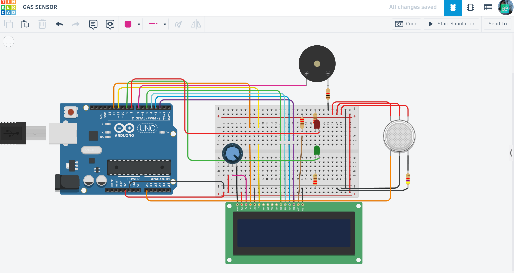

# ⛽ Smart Gas Leak Detector with LCD Alert (L9-Gas)

A professional hardware-software solution designed to detect flammable or toxic gas leaks and provide instant visual and acoustic alerts.

## 📌 Project Overview
This system utilizes an analog gas sensor to monitor air quality in real-time. When gas concentration exceeds a predefined safety threshold, the system triggers a "Danger" state, displaying an "ALERT" message on the LCD, activating a red LED, and sounding a high-pitched siren through a buzzer.

## ⚙️ How it Works (System Logic)
The system continuously monitors the sensor values and switches between two states:

* **Safe State (Concentration < 400):**
    * Green LED is ON.
    * LCD is clear (or shows "Safe" status).
    * Buzzer is silent.
* **Danger State (ALERT) (Concentration > 400):**
    * Red LED turns ON.
    * Green LED turns OFF.
    * **LCD Display:** Shows a centered "**ALERT**" message.
    * **Acoustic:** Plays a continuous 1000Hz tone using the `tone()` function for maximum urgency.

## 🛠 Technical Highlights
- **LCD Interface:** Integrated 16x2 LCD display using the `LiquidCrystal` library for real-time user feedback.
- **Threshold Calibration:** Adjustable sensitivity via code (`sensorThresh`) to adapt to different environments.
- **Multi-Channel Signaling:** Simultaneous use of visual (LED), textual (LCD), and acoustic (Buzzer) indicators.

## 🔌 Components Used
- **Microcontroller:** Arduino Uno R3
- **Sensor:** Gas Sensor (Analog MQ-type)
- **Display:** 16x2 LCD Display
- **Indicators:** Piezo Buzzer, Red & Green LEDs
- **Others:** Potentiometer (for LCD contrast), 220Ω Resistors, Breadboard.

## 📐 Circuit Diagram

*Designed and simulated in Tinkercad.*

## 🚀 Installation & Use
1. Open the [gas_detector.ino](./gas_detector.ino) file in this folder.
2. Copy the code to your Arduino IDE or Tinkercad environment.
3. Ensure the `LiquidCrystal` library is included in your project.
4. In simulation, move the "gas cloud" towards the sensor to trigger the alarm.
5. Use the potentiometer to adjust the text clarity on the physical LCD.

## 📺 Video Demonstration
Watch the system in action (click the image below):

## 🔗 Interactive Simulation

