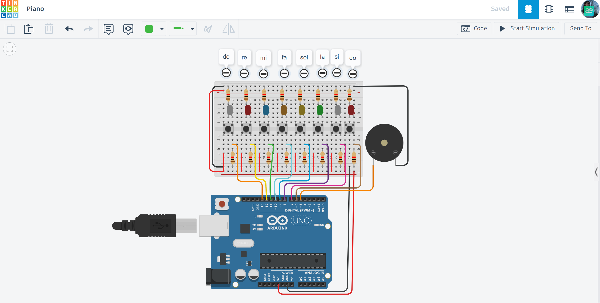

# 🎹 Arduino Digital Piano: 8-Note Synth

A professional, interactive electronic piano built on Arduino Uno, combining musical programming with real-time visual feedback.

## 📌 Project Overview
The "Arduino Digital Piano" is an 8-note synthesizer that allows users to play a full octave (from C4 to C5). This project demonstrates how to handle multiple digital inputs, map them to specific audio frequencies, and synchronize sound with LED light effects.

## ⚙️ How it Works (System Logic)
1. **Input Monitoring:** The system continuously scans 8 digital pins connected to push buttons.
2. **Frequency Mapping:** When a button is pressed, the code identifies the corresponding musical note and retrieves its frequency (Hz).
3. **Audio-Visual Feedback:** - **Buzzer:** Generates a clean tone for the specific note using PWM.
   - **LEDs:** Each note triggers a dedicated LED, creating a "light-organ" effect that corresponds to the pitch.
4. **Instant Response:** Optimized for low latency, ensuring the sound plays the exact moment a button is pressed.

## 🛠 Technical Features
- **Tone Generation:** Uses the `tone()` function for precise frequency reproduction of musical notes.
- **Array-Based Logic:** Managed via arrays for pins and frequencies, making the code clean, efficient, and easy to scale.
- **Circuit Stability:** Implements 10kΩ pull-down resistors to ensure stable digital readings and prevent "floating" inputs.

## 🔌 Components Used
- **Microcontroller:** Arduino Uno R3
- **Inputs:** 8x Push Buttons (Tactile Switches)
- **Visual Outputs:** 8x LEDs (Multiple colors for visual distinction)
- **Acoustic Output:** 1x Piezo Buzzer
- **Others:** 220Ω & 10kΩ Resistors, Breadboard, and Jumper wires.

## 📐 Circuit Diagram

*Designed and simulated in Tinkercad.*

## 🚀 Installation & Use
1. **Get the Code:** Open the [main.ino](./main.ino) file and copy the source code.
2. **Setup:** Paste the code into your Arduino IDE or the "Code" block in Tinkercad.
3. **Hardware:** Connect the buttons to pins 6-13 and the LEDs to the designated output pins according to the schematic.
4. **Play:** Start the simulation or power up your Arduino, and start composing your own melodies!

## 📺 Video Demonstration

