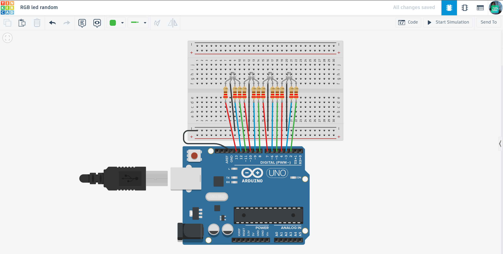

# 🌈 RGB Mood Lamp

A simple yet powerful lighting project that controls four RGB LEDs to create different color atmospheres and moods.

## 📌 Project Overview
The "RGB Mood Lamp" uses four RGB LEDs to light up a space with various colors. From warm orange tones to deep night purples, this project shows how to mix Red, Green, and Blue light to create any color you want using Arduino.

## ⚙️ How it Works (Logic)
1. **Input Control:** The Arduino sends signals to 12 different pins to control the red, green, and blue parts of each LED.
2. **Color Presets:** The code cycles through three main modes:
   - **Warm:** Cozy colors like orange and lime.
   - **Night:** Calm colors like purple and deep blue.
   - **Traffic:** Basic Red, Yellow, Green, and Blue.
3. **Smooth Switching:** Each color stays for 1.5 seconds before moving to the next one.

## 🛠 Technical Features
- **PWM Modulation:** Uses `analogWrite` to mix brightness levels for custom colors.
- **Easy Coding:** All 4 LEDs are controlled by one simple function called `setAllColors`.
- **Scalability:** The logic can be easily expanded to control more LEDs or different color patterns.

## 🔌 Components Used
- **Microcontroller:** Arduino Uno R3
- **Light Sources:** 4x RGB LEDs (Common Cathode)
- **Protection:** 12x 220Ω Resistors
- **Connection:** Breadboard & Jumper wires

## 📐 Circuit Diagram

*Designed and simulated in Tinkercad.*

## 🚀 Installation & Use
1. **Get the Code:** Open the [main.ino](./main.ino) file and copy the source code.
2. **Setup:** Connect the LEDs to the pins (13-2) as specified in the code.
3. **Upload:** Flash the code to your Arduino and watch the colors change!

## 📺 Video Demonstration

## 🔗 Interactive Simulation

