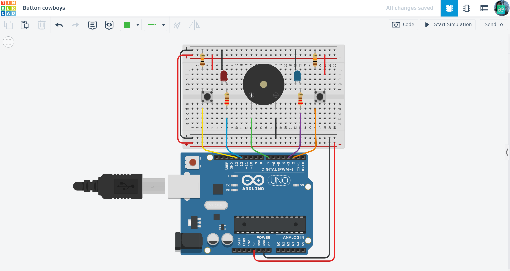

# 🤠 Arduino Reaction Game: Cowboy Duel

A fun, competitive 2-player game designed to test and measure reaction speed using visual and acoustic triggers.

## 📌 Project Overview
The "Cowboy Duel" is a speed-reaction trainer. The system waits for a random interval before sounding a "start" signal. The first player to press their button after the signal wins the round, triggering a victory light and a high-pitched sound.

## ⚙️ How it Works (Game Logic)
1. **Random Wait:** The system pauses for a random duration (between 1 and 3 seconds) to prevent players from predicting the start.
2. **Start Signal:** The buzzer sounds a distinct tone, signaling players to "draw."
3. **Winner Detection:** The code enters a high-speed loop to check which button is pressed first.
4. **Victory Celebration:** - The winner's LED lights up.
   - A unique victory tone plays.
   - The system resets for the next round.

## 🛠 Technical Features
- **Randomization:** Uses `random(1000, 3000)` to ensure every round is unpredictable.
- **Input Management:** Implements `INPUT_PULLUP` for stable button readings without external resistors.
- **Fast Response Loop:** A dedicated `for` loop efficiently monitors multiple inputs to determine the winner with millisecond precision.

## 🔌 Components Used
- **Microcontroller:** Arduino Uno R3
- **Inputs:** 2x Push Buttons
- **Visual Outputs:** 2x LEDs (Red & Blue)
- **Acoustic Output:** Piezo Buzzer
- **Others:** 220Ω Resistors, Breadboard, and Jumper wires.

## 📐 Circuit Diagram

*Designed and simulated in Tinkercad.*

## 🚀 Installation & Use
1. **Get the Code:** Open the [main.ino](./main.ino) file and copy the source code.
2. **Setup:** Paste the code into your Arduino IDE or a new Tinkercad "Code" block.
3. **Hardware:** Connect two players to the designated pins (Player 1: Pin 2/3, Player 2: Pin 13/12).
4. **Play:** Start the simulation, wait for the buzzer signal, and be the fastest to press your button!

## 📺 Video Demonstration

