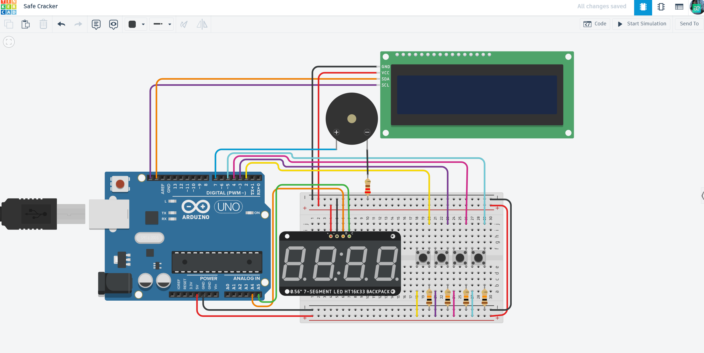

# 🔐 Safe Cracker: Digital Code Lock

An interactive puzzle and security simulation project that challenges users to guess a 4-digit secret code using multiple displays and tactile inputs.

## 📌 Project Overview
"Safe Cracker" is a logic-based game where the Arduino acts as a secure vault. It features a 7-segment display for the current guess and an LCD for system status. The project demonstrates advanced techniques in state management, display multiplexing, and user interaction logic.

## ⚙️ How it Works (Game Logic)
1. **Secret Initialization:** A 4-digit code is hardcoded into the system (e.g., `1234`).
2. **Input System:** Four tactile buttons control the digits:
   - Thousands, Hundreds, Tens, and Ones are incremented independently.
3. **Dual Display Feedback:** - **7-Segment Display:** Shows the current 4-digit number being entered.
   - **16x2 LCD:** Provides instructions and the final "ACCESS GRANTED" message.
4. **Victory Condition:** Once the guess matches the secret code, the system triggers a victory melody and locks the input until reset.

## 🛠 Technical Features
- **I2C Bus Integration:** Multiple devices (LCD & 7-Segment) share the same data lines (SDA/SCL) for efficient pin usage.
- **Library Integration:** Utilizes `Adafruit_LEDBackpack` for 7-segment control and `Adafruit_LiquidCrystal`.
- **Audio Feedback:** Unique high-pitched beeps for every button press and a special celebratory melody upon success.
- **Debounce Logic:** Software-based delays to ensure stable button inputs and prevent double-triggering.

## 🔌 Components Used
- **Microcontroller:** Arduino Uno R3
- **Visual Outputs:** 1x 16x2 LCD (I2C), 1x 7-Segment Display (I2C)
- **Inputs:** 4x Pushbuttons
- **Acoustic Output:** 1x Piezo Buzzer
- **Others:** 10kΩ Pull-down resistors, Breadboard, and Jumper wires.

## 📐 Circuit Diagram

*Designed and simulated in Tinkercad.*

## 🚀 Installation & Use
1. **Get the Code:** Open the [main.ino](./main.ino) file and copy the source code.
2. **Setup:** Paste the code into your Arduino IDE or a new Tinkercad "Code" block.
3. **Libraries:** Ensure you have `Adafruit LED Backpack` and `Adafruit LiquidCrystal` installed.
4. **Play:** Start the simulation, use the buttons to enter the code, and crack the safe!

## 📺 Video Demonstration

## 🔗 Interactive Simulation

