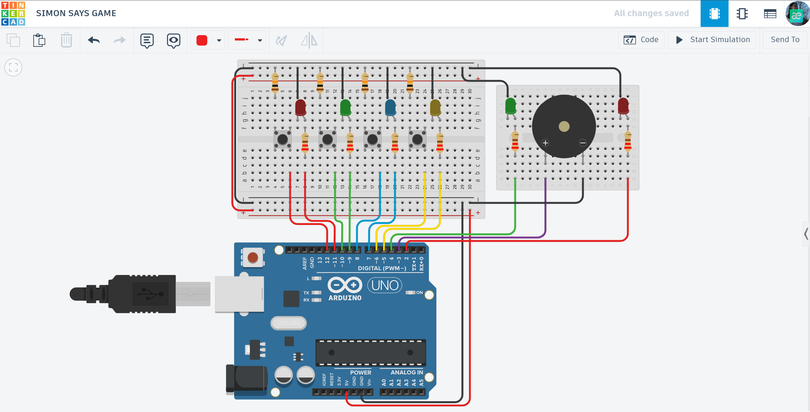

# 🧠 Arduino Simon Says: Memory Challenge Game

A professional engineering recreation of the classic electronic memory game. The system generates increasingly complex sequences of lights and tones that the player must replicate with perfect precision.

## 📌 Project Overview
The "Simon Says" project is a sophisticated exercise in logic state management. It utilizes four primary colored channels (Red, Green, Blue, Yellow), each mapped to a specific LED, button, and frequency. The system is designed to be intuitive, guiding the player through escalating levels of difficulty by increasing sequence length and playback speed.

## ⚙️ How it Works (Game Logic)
1. **Sequence Generation:** Upon start, the system generates a random array of 50 steps using `randomSeed()` to ensure a unique experience every session.
2. **Playback Phase:** The Arduino flashes the LEDs and plays tones in the current sequence. As levels progress, the game speed automatically increases to challenge the player's reflexes.
3. **Player Input:** The player must repeat the sequence using the four-button interface.
4. **System Feedback:** - **Correct:** The green status LED flashes, and the system proceeds to the next level.
   - **Game Over:** If a mistake is made, the red LED lights up and a fail tone plays.
   - **Reset:** Pressing any button after a loss clears all variables and restarts the game from Level 1.

## 🛠 Technical Features
- **State Machine Architecture:** A dedicated status controller (`gameStatus`) manages transitions between playback, user input, and system reset states.
- **Dynamic Difficulty Scaling:** Implements an acceleration algorithm where the playback delay decreases by 15ms each round.
- **Hardware Optimization:** Utilizes `INPUT_PULLUP` logic to minimize external components and ensure stable digital signal processing.
- **Synchronized Audio-Visuals:** Maps precise acoustic frequencies to LED outputs for a multi-sensory user interface.

## 🔌 Components Used
- **Microcontroller:** Arduino Uno R3
- **Inputs:** 4x Push Buttons (R, G, B, Y)
- **Visual Output:** 6x LEDs (4 Game Channels + 2 Status Indicators)
- **Audio Output:** Piezo Buzzer
- **Others:** 220Ω Resistors, Breadboard, and Jumper wires.

## 📐 Circuit Diagram

*Designed and simulated in Tinkercad.*

## 🚀 Installation & Use
1. **Get the Code:** Open the [main.ino](./main.ino) file and copy the source code.
2. **Setup:** Paste the code into your Arduino IDE or a new Tinkercad "Code" block.
3. **Hardware:** Connect the components to the pins specified in the `LED_PINS` and `BUTTON_PINS` arrays.
4. **Play:** Start the simulation, memorize the sequence, and see how many levels you can clear!

## 📺 Video Demonstration

## 🔗 Interactive Simulation

