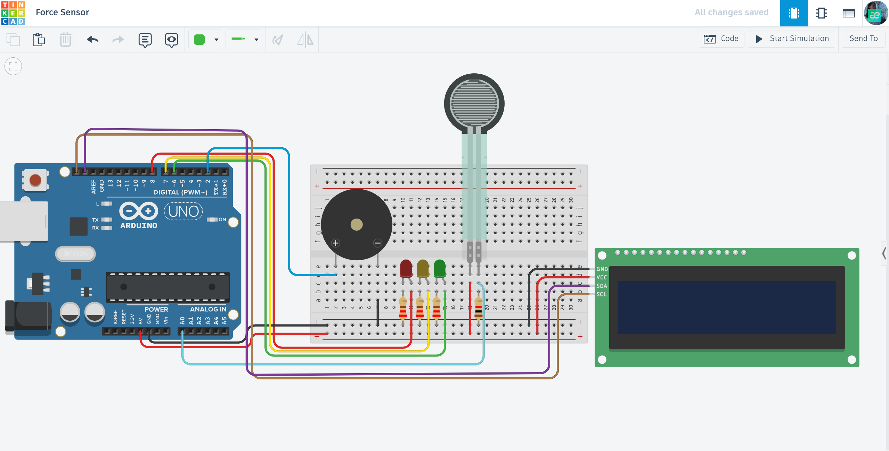

# ⚖️ Smart Force Monitoring System

An intelligent pressure-sensing system that monitors physical force in real-time and provides multi-layered visual, acoustic, and textual feedback.

## 📌 Project Overview
The "Smart Force Monitor" is designed to detect and categorize physical pressure using a Force Sensitive Resistor (FSR). The system acts as a safety interface, providing a clear "Traffic Light" LED indication and an LCD status report, with a built-in alarm for overload conditions.

## ⚙️ How it Works (Logic)
The system operates on a threshold-based logic, processing analog data from the sensor into four distinct states:

1. **NO LOAD (Value < 1):** System is idle. All LEDs and the buzzer are OFF.
2. **NORMAL (1 - 250):** Safe operating pressure. **Green LED** is ON.
3. **MEDIUM (251 - 370):** Moderate pressure detected. **Yellow LED** is ON.
4. **OVERLOAD (> 370):** Critical pressure level. **Red LED** is ON, and the **Piezo Buzzer** triggers a constant 1000Hz alert tone.

## 🛠 Technical Features
- **Precise Thresholding:** Fine-tuned `if-else` logic for accurate state switching.
- **I2C Display Integration:** Uses `Adafruit_LiquidCrystal` to minimize wiring while providing detailed telemetry.
- **Acoustic Warning System:** High-frequency tone generation for immediate safety response.
- **Responsive UI:** Real-time data refresh (100ms delay) for instantaneous feedback on force changes.

## 🔌 Components & Pinout
| Component | Arduino Pin | Description |
| :--- | :--- | :--- |
| **Force Sensor (FSR)** | A0 (Analog) | Measures physical pressure |
| **I2C LCD Display** | SDA/SCL (A4/A5) | Displays "Force" value and "Status" |
| **Piezo Buzzer** | D2 | Acoustic alert for Overload |
| **Green LED** | D6 | Status: Normal |
| **Yellow LED** | D7 | Status: Medium |
| **Red LED** | D8 | Status: Overload |

## 📐 Circuit Diagram

*Designed and simulated in Tinkercad.*

## 🚀 Installation & Use
1. **Library Requirement:** Install the `Adafruit_LiquidCrystal` library via the Arduino Library Manager.
2. **Setup:** Connect the components according to the pinout table above.
3. **Upload:** Flash the provided `main.ino` code to your Arduino Uno.
4. **Testing:** Apply pressure to the FSR sensor and monitor the transitions on the LCD and LEDs.

## 📺 Video Demonstration

## 🔗 Interactive Simulation

