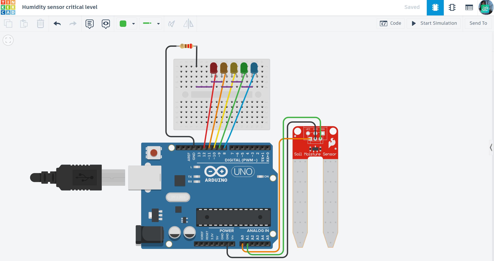

# 🪴 Smart Plant Monitoring System (Soil Moisture Sensor)

An intelligent hardware-software solution for real-time soil moisture tracking and automated plant care alerts.

## 📌 Project Overview
This system is designed to prevent plant dehydration by monitoring soil moisture levels. It provides a visual 5-level LED scale and a dynamic blinking alert system to notify the user when the plant requires immediate watering.

## ⚙️ How it Works (Logic)
The system reads analog data from the sensor and categorizes the hydration level:
* **Optimal (>800):** Blue LED — Soil is well-hydrated.
* **Good (600-800):** Green LED — Moisture level is stable.
* **Normal (400-600):** Yellow LED — Moderate moisture.
* **Low (200-400):** Orange LED — Plant will need water soon.
* **Critical (<200):** Red LED with **Active Blinking** — Urgent watering required.

## 🛠 Technical Features
- **Non-blocking Code:** Uses `millis()` for the alert system, ensuring the microcontroller remains responsive without using `delay()`.
- **Corrosion Protection:** Power is supplied to the sensor only during the 10ms reading window to extend the sensor's lifespan.
- **Visual Feedback:** A clear 5-LED bar for easy status monitoring.

## 🔌 Components Used
- **Microcontroller:** Arduino Uno R3
- **Sensor:** Soil Moisture Sensor (Analog)
- **Indicators:** 5x LEDs (Red, Orange, Yellow, Green, Blue)
- **Others:** Resistors (220Ω), Breadboard, and Jumper wires.

## 📐 Circuit Diagram

*Designed and simulated in Tinkercad.*

## 🚀 Installation & Use
1. Open the `smart_plant_monitor.ino` file in this folder.
2. Copy the code to your Arduino IDE or Tinkercad environment.
3. Connect the sensor's VCC to pin **A0** (for power management).
4. Monitor real-time values through the **Serial Monitor** at 9600 baud.

## 📺 Video Demonstration
Watch the system in action (click the image below):

