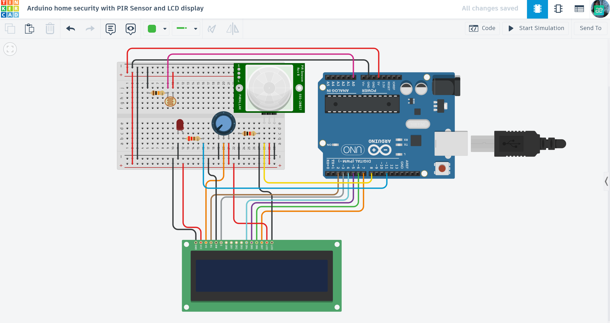

# 🛡️ Smart Home Security System (LCD-PIR-LDR)

An integrated security solution featuring motion detection and ambient light sensing for automated property protection.

## 📌 Project Overview
This system acts as a smart guardian. It uses a PIR (Passive Infrared) sensor to detect movement and an LDR (Light Dependent Resistor) to monitor environmental lighting conditions. Status updates and alerts are displayed in real-time on a 16x2 LCD screen.

## ⚙️ How it Works (System Logic)
The system operates based on two main inputs:
* **Motion Detection (PIR):** If movement is detected, the system triggers an "Intruder Alert".
* **Light Intensity (LDR):** Monitors whether it is dark or light, which can be used to auto-arm the system at night.
* **Feedback:** - **LCD:** Displays "System Armed" or "INTRUDER ALERT!".
    - **Visual:** LED indicator triggers during detection.

## 🛠 Technical Highlights
- **Dual-Sensor Fusion:** Combines digital (PIR) and analog (LDR) signals for complex decision-making.
- **Real-time Interface:** Utilizes the `LiquidCrystal` library for clear status reporting.
- **Adjustable Sensitivity:** The LDR allows the system to differentiate between day and night modes.

## 🔌 Components Used
- **Microcontroller:** Arduino Uno R3
- **Sensors:** PIR Motion Sensor, Photoresistor (LDR)
- **Display:** 16x2 LCD Display
- **Output:** LED (Red)
- **Others:** Potentiometer, Resistors (10kΩ, 220Ω), Breadboard.

## 📐 Circuit Diagram

*Designed and simulated in Tinkercad.*

## 📺 Video Demonstration

## 🚀 Installation & Use
1. Copy the code from [View main.ino](./main.ino) to your IDE.
2. Ensure sensors are connected to the correct pins (PIR to Digital, LDR to Analog).
3. Adjust the potentiometer to calibrate LCD contrast.
